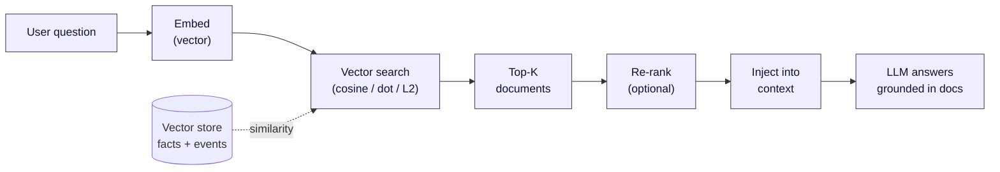
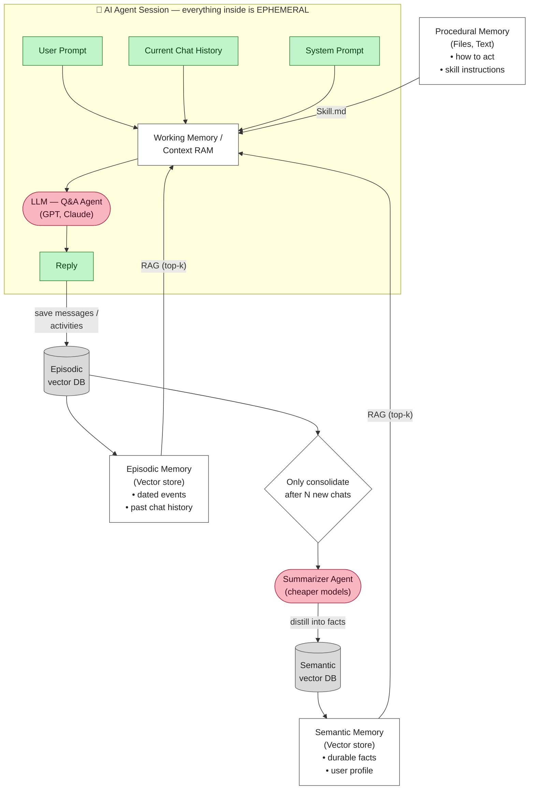
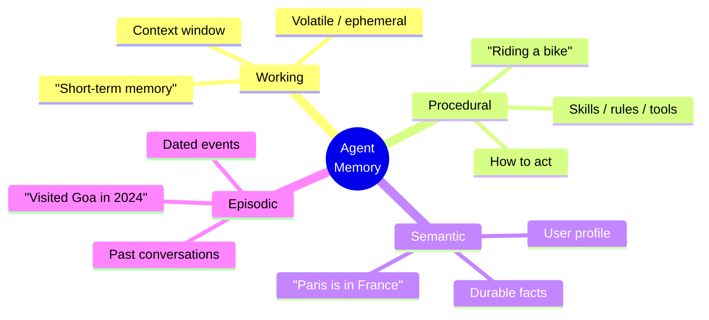

# AI Agent Memory Architecture — Deep Dive

> A complete explanation of the memory architecture shown in the diagram, plus
> every other major memory approach used in production LLM agents
> (LangGraph, CrewAI, AutoGPT, MemGPT/Letta, Mem0, Generative Agents, RAG stacks).

---

## Table of Contents

1. [The Core Idea](#1-the-core-idea)
2. [The Diagram, Component by Component](#2-the-diagram-component-by-component)
   - [2.1 Ephemeral Session Box](#21-ephemeral-session-box)
   - [2.2 User Prompt](#22-user-prompt)
   - [2.3 Current Chat History](#23-current-chat-history)
   - [2.4 System Prompt](#24-system-prompt)
   - [2.5 Working Memory / Context RAM](#25-working-memory--context-ram)
   - [2.6 LLM / Q&A Agent](#26-llm--qa-agent)
   - [2.7 Reply](#27-reply)
   - [2.8 Procedural Memory](#28-procedural-memory)
   - [2.9 Semantic Memory](#29-semantic-memory)
   - [2.10 Episodic Memory](#210-episodic-memory)
   - [2.11 RAG / Top-K Search](#211-rag--top-k-search)
   - [2.12 Save Messages / Activities](#212-save-messages--activities)
   - [2.13 Raw Conversation Database](#213-raw-conversation-database)
   - [2.14 Consolidate After N Chats](#214-consolidate-after-n-chats)
   - [2.15 Summarizer Agent](#215-summarizer-agent-cheaper-models)
   - [2.16 Distill Into Facts](#216-distill-into-facts)
3. [Complete Data Flow](#3-complete-data-flow)
4. [The Four Memory Types — Reference Table](#4-the-four-memory-types--reference-table)
5. [Other Memory Approaches That Exist](#5-other-memory-approaches-that-exist)
   - [5.1 Conversation Buffer Memory](#51-conversation-buffer-memory)
   - [5.2 Sliding Window Memory](#52-sliding-window-buffer-window-memory)
   - [5.3 Summary Memory](#53-conversation-summary-memory)
   - [5.4 Summary-Buffer (Hybrid)](#54-summary-buffer-memory-hybrid)
   - [5.5 Vector-Store-Backed Memory (RAG Memory)](#55-vector-store-backed-memory-rag-memory)
   - [5.6 Entity Memory](#56-entity-memory)
   - [5.7 Knowledge-Graph Memory](#57-knowledge-graph-memory)
   - [5.8 MemGPT / Letta — OS-Style Paged Memory](#58-memgpt--letta--os-style-paged-memory)
   - [5.9 Mem0 — Managed Memory Layer](#59-mem0--managed-memory-layer)
   - [5.10 Generative Agents (Reflection + Importance)](#510-generative-agents-stanford--reflection--importance)
   - [5.11 Hierarchical / Tiered Memory](#511-hierarchical--tiered-memory)
   - [5.12 Scratchpad / Chain-of-Thought Memory](#512-scratchpad--working-notes-memory)
   - [5.13 Long-Context "No Memory" Approach](#513-long-context-brute-force-no-external-memory)
   - [5.14 Cache-Augmented Generation (CAG)](#514-cache-augmented-generation-cag)
6. [How to Choose](#6-how-to-choose-an-approach)
7. [Production Stack Reference](#7-production-stack-reference)
8. [Human Brain Analogy](#8-human-brain-analogy)
9. [A Minimal Reference Implementation](#9-a-minimal-reference-implementation)
10. [Common Pitfalls](#10-common-pitfalls--gotchas)

---

## 1. The Core Idea

> **The LLM itself is stateless. The *session* is ephemeral. Persistence and
> "intelligence over time" are an illusion created by external memory systems
> that re-inject the right information into the context window at the right time.**

Every time you call an LLM API, the model receives a fresh, self-contained block
of text (the context window) and produces output. It remembers **nothing** from
the previous call. The model weights are frozen at training time.

So the entire field of "agent memory" is really one engineering problem:

```
What do we store outside the model,
and how do we decide what to put back into the context window
on the next turn?
```

Everything in the diagram — and every alternative approach in Section 5 — is a
different answer to that single question.

---

## 2. The Diagram, Component by Component

### 2.1 Ephemeral Session Box

> *"everything inside the box is ephemeral"*

The top box (User Prompt → Working Memory → LLM → Reply) exists **only for the
duration of one request/conversation**. When the session ends, it evaporates,
exactly like human short-term/working memory. Nothing inside the box survives
unless it is explicitly written out to one of the persistent stores below.

This is the single most important mental model: **the box forgets; the stores remember.**

---

### 2.2 User Prompt

The direct instruction from the user this turn.

```text
User: Book me a flight to Bangalore next week.
```

It is one input among several that get assembled into the context window.

---

### 2.3 Current Chat History

The turns *so far in this session*. It provides local coreference and continuity.

```text
User: I live in Delhi.
User: I want to visit Bangalore.
User: Book a flight.
```

The model resolves "Book a flight" → "Delhi → Bangalore" only because the prior
turns are present. Drop them and the instruction becomes unanswerable. This is
the rawest, simplest form of memory — and it lives entirely inside the ephemeral box.

---

### 2.4 System Prompt

The instruction block that sets identity, rules, safety boundaries, output
format, and tool-use policy.

```text
You are a helpful assistant. Be concise. Never reveal secrets.
Use tools when necessary.
```

It controls **personality, safety, rules, style, and tool usage**. It is usually
fixed per agent/role (e.g. "You are a Java expert", "You are a medical assistant").

---

### 2.5 Working Memory / Context RAM

**The most important component.** This is the model's "RAM" — the single
assembled context window that actually gets sent to the LLM. It is the
*confluence* of every other source:

```text
System Prompt
+ Chat History
+ Retrieved Memories (from Semantic / Episodic / Procedural)
+ Tool Outputs
+ User Prompt
─────────────────────────
= one large context block → LLM
```

Example of an assembled context:

```text
SYSTEM:   You are helpful.
MEMORY:   User likes Python. User works with GCP.
CHAT:     User asked about FastAPI yesterday.
QUESTION: Teach me APIs.
```

The art of agent engineering is **context assembly** (a.k.a. "context
engineering"): deciding what to load into this finite space and in what order,
because the window has a hard token limit and every token costs money and latency.

---

### 2.6 LLM / Q&A Agent

The reasoning engine — GPT, Claude, Gemini, Llama, Mistral, etc.

```text
Input: Context Window  →  Reasoning  →  Output
```

Critical property: **the LLM has no long-term memory of its own.** It only knows
what is inside the current context window. When the conversation ends, that
knowledge is gone. *This is the entire reason external memory systems exist.*

> In this project, default to the latest Claude models (Opus 4.8, Sonnet 4.6,
> Haiku 4.5) for the reasoning agent, and a cheaper tier for the summarizer.

---

### 2.7 Reply

The generated answer. After it is produced, the interaction is **saved to
persistent memory** ("Save the messages / activities" arrow) so future sessions
can benefit from it.

---

### 2.8 Procedural Memory

> **HOW to do things** — the "muscle memory" of the agent.

Human analogy: riding a bicycle, driving, the steps of a workflow you've internalized.

Contents: instructions, rules, workflows, policies, tool definitions, agent skills.

```text
skills/support_agent.md
  You are a customer support agent. Always:
  1. Verify identity
  2. Check account
  3. Solve issue
  4. Ask for feedback
```

```text
skills/
    python.md
    sql.md
    aws.md
    travel_agent.md
```

These are typically **plain files/text** (Markdown), loaded into the context
*on demand* when the relevant task arises. In the diagram this is the `Skill.md`
arrow feeding Working Memory. (This is exactly the pattern Claude Code "skills"
and `CLAUDE.md` use.)

Key distinction: procedural memory is rarely retrieved by vector search — it is
usually loaded by **rule or routing** ("this is a SQL task → load sql.md").

---

### 2.9 Semantic Memory

> **FACTS** — durable, timeless knowledge about the user and the world.

Human analogy: "I know that Paris is the capital of France."

```text
User prefers backend over frontend.
User lives in Bangalore.
User uses Windows.
Company policy: employees get 30 days leave.
```

Stored as embeddings in a **vector database** (Pinecone, FAISS, Weaviate,
Chroma, Milvus, Qdrant) and retrieved by similarity (RAG). A record looks like:

```json
{ "fact": "User prefers backend development over frontend" }
```

These facts persist **across all conversations** and form the user profile +
durable domain knowledge.

---

### 2.10 Episodic Memory

> **PAST EXPERIENCES / EVENTS** — what happened, and when.

Human analogy: "Last year I visited Goa." "Yesterday I met John."

The difference from semantic memory is **time + specificity**:

| Semantic (fact)        | Episodic (event)                          |
| ---------------------- | ----------------------------------------- |
| "User likes Python."   | "On 2025-06-12 the user built a FastAPI project." |

Stored as a vector embedding **plus metadata**:

```json
{
  "date": "2025-06-12",
  "event": "Built FastAPI project",
  "conversation_id": "abc123",
  "user_id": "u_42"
}
```

Retrieved by RAG (often filtered by time/user). Episodic memory is what lets an
agent say "last time we talked about X, you decided Y."

---

### 2.11 RAG / Top-K Search

> **Retrieval Augmented Generation** — fetch the most relevant memories and
> inject them into the context instead of stuffing *everything* in.

```text
User question
  → embed into a vector
  → similarity search over the vector store
  → take Top-K most similar documents
  → prepend them to the context
  → LLM answers grounded in those documents
```

Example — user asks "What framework do I prefer?":

```text
Top-K hits:
  1. "User prefers NestJS"
  2. "User likes backend work"
```

- **Top-K** = how many results to pull back (top 3 / 5 / 10). Higher K = more
  recall but more tokens and more noise.
- **Similarity metrics**: cosine similarity, dot product, Euclidean distance.
- **Vector DBs**: FAISS, Pinecone, Qdrant, Milvus, Chroma, Weaviate.



RAG is the mechanism that connects the persistent stores back into the ephemeral
box. In the diagram, both Semantic and Episodic memory feed Working Memory via
RAG arrows.

> Modern refinements: **hybrid search** (vector + keyword/BM25), **re-ranking**
> (a cross-encoder re-scores the Top-K), and **metadata filtering** (restrict to
> this user / recent dates) — all reduce the "retrieved the wrong thing" failure mode.

---

### 2.12 Save Messages / Activities

After each reply, the full interaction (user message + assistant message +
metadata) is written to durable storage:

```json
{ "user": "...", "assistant": "...", "timestamp": "..." }
```

Possible stores: PostgreSQL, MongoDB, Redis, S3, or directly into a vector DB.

This is the *write path* that feeds everything downstream (raw DB → summarizer →
distilled facts).

---

### 2.13 Raw Conversation Database

The complete, unprocessed chat log — the system of record.

```text
Conversation #123 → Message 1, Message 2, Message 3, ...
```

Tech: Postgres, MongoDB, DynamoDB, Firestore.

Purpose: auditing, analytics, **memory creation (source material for the
summarizer)**, and conversation replay. You keep the raw log because distillation
is lossy — if your fact-extraction logic improves, you can re-run it over history.

---

### 2.14 Consolidate After N Chats

An **optimization gate**. Instead of summarizing after every single message
(expensive, noisy), wait until N new messages/conversations accumulate, then run
consolidation once.

Benefits:

- **Cost** — one batched call to a cheap model instead of N calls.
- **Quality** — patterns emerge across multiple turns:

  ```text
  Weak (per-message):   "User likes pizza."
  Strong (consolidated): "User consistently prefers Italian food."
  ```

The diamond in the diagram is this conditional ("Only consolidate after N new chats").

---

### 2.15 Summarizer Agent (Cheaper Models)

A **background worker** that runs on a cheap, fast model (GPT-4o-mini, Claude
Haiku, Gemini Flash, Llama 8B). It is deliberately *not* the expensive reasoning
model, because its job is mechanical:

```text
Raw conversations → extract facts → create memories → store in Semantic Memory
```

Example:

```text
Input:
  "I love Python." / "I use Windows." / "I work with GCP."
Output:
  ["User likes Python", "User uses Windows", "User works with GCP"]
```

This process is called **memory distillation**. Running it asynchronously keeps
it off the user's critical path (no added latency to replies).

---

### 2.16 Distill Into Facts

The compression step: turn thousands of raw messages into a handful of durable,
high-signal facts.

```text
Raw:
  "I hate frontend." / "CSS scares me." / "Backend is easier."
Distilled fact:
  "User prefers backend development."
```

Benefits:

- **Storage** — 100 MB of chat → ~1 MB of facts.
- **Retrieval quality** — searching 10 clean facts beats searching 1,000 noisy
  messages (less distraction for the LLM, higher precision).

The distilled facts flow back **up** into Semantic Memory (the "Distill into
facts" arrow), closing the loop.

---

## 3. Complete Data Flow

### Rendered diagram (Mermaid)



### ASCII view

```text
            ┌──────────────────── EPHEMERAL SESSION ────────────────────┐
            │                                                            │
 User Prompt ─┐                                                          │
 Chat History ─┼──► Working Memory / Context RAM ──► LLM ──► Reply ──────┼──┐
 System Prompt ┘            ▲   ▲   ▲                                    │  │
            │               │   │   │                                    │  │
            └───────────────┼───┼───┼────────────────────────────────────┘  │
                            │   │   │                                        │
              Skill.md ─────┘   │   └───── RAG (top-k) ──── Episodic Memory  │
            (Procedural)        │                                ▲           │
                          RAG (top-k)                            │           │
                                │                                │           │
                         Semantic Memory                         │           │
                                ▲                                │           │
                                │                                │           │
                          [Vector store]                   [Vector store] ◄──┘
                                ▲                                │   (save messages)
                                │                                │
                       Distill into facts                        ▼
                                │                      ┌───────────────────┐
                                │                      │ Consolidate after │
                                └──────────────────────│   N new chats?    │
                                                       └─────────┬─────────┘
                                                                 ▼
                                                       Summarizer Agent
                                                       (cheap model)
```

Linear view:

```text
User Prompt → Working Memory → LLM → Reply
                                       ↓
                              Store conversation (raw DB)
                                       ↓
                            Consolidate after N chats?
                                       ↓
                            Summarizer Agent (cheap)
                                       ↓
                              Distill into facts
                                       ↓
                              Semantic Memory  ──┐
                              Episodic Memory  ──┼─► re-injected next session via RAG
                              Procedural (files)─┘
```

---

## 4. The Four Memory Types — Reference Table




| Type           | Stores                         | Human analogy           | Typical backend                | Retrieval         |
| -------------- | ------------------------------ | ----------------------- | ------------------------------ | ----------------- |
| **Working**    | Current context window         | Short-term memory       | In-RAM / framework state       | N/A (it *is* context) |
| **Procedural** | How-to: skills, rules, tools   | Riding a bike           | Markdown files / config        | Rule/route-loaded |
| **Semantic**   | Durable facts, user profile    | "Paris is in France"    | Vector DB                      | RAG (top-k)       |
| **Episodic**   | Dated events, past chats       | "I visited Goa in 2024" | Vector DB + metadata           | RAG (top-k + time filter) |

---

## 5. Other Memory Approaches That Exist

The diagram shows one mature, full design. In practice teams pick a point on a
spectrum from *dead simple* to *OS-grade*. Here are the major alternatives, in
rough order of increasing sophistication.

### 5.1 Conversation Buffer Memory

**Keep the entire conversation verbatim in the context, every turn.**

```text
context = system_prompt + ALL previous turns + new message
```

- ✅ Zero information loss; trivial to implement; perfect local coherence.
- ❌ Grows unbounded → eventually overflows the context window; cost and latency
  scale with conversation length.
- **Use when**: short sessions, prototypes, or when the whole task fits the window.
- LangChain name: `ConversationBufferMemory`.

---

### 5.2 Sliding Window (Buffer-Window) Memory

**Keep only the last *k* turns; drop the oldest.**

```text
context = system_prompt + last_k_turns + new message
```

- ✅ Bounded size and cost; simple.
- ❌ Hard forgetting — anything older than *k* turns is gone, even if important.
- **Use when**: long chats where only recent context matters (e.g. live support).
- LangChain name: `ConversationBufferWindowMemory`.

---

### 5.3 Conversation Summary Memory

**Replace old turns with a running natural-language summary.**

```text
context = system_prompt + running_summary + recent_turns + new message
```

Each turn (or every N turns) an LLM updates the summary. This is essentially the
**Summarizer Agent** idea from the diagram applied to *the live session itself*
rather than to long-term stores.

- ✅ Bounded size while retaining the *gist* of the whole conversation.
- ❌ Lossy — specific details/numbers get smoothed away; summary drift over time;
  extra LLM call per update.
- LangChain name: `ConversationSummaryMemory`.

---

### 5.4 Summary-Buffer Memory (Hybrid)

**Keep recent turns verbatim *and* a summary of everything older.** The most
common practical default.

```text
context = system_prompt + summary_of_old + verbatim_recent_turns + new message
```

- ✅ Best of both: exact recent detail + compressed long-term gist; bounded.
- ❌ More moving parts; tuning the verbatim/summary boundary.
- LangChain name: `ConversationSummaryBufferMemory`.

---

### 5.5 Vector-Store-Backed Memory (RAG Memory)

**Embed every message/turn; at query time retrieve only the top-k most relevant
past pieces.** This is exactly the Semantic/Episodic mechanism in the diagram,
used as the *session* memory too.

- ✅ Scales to effectively unlimited history; pulls back relevant detail from far
  back; cost is bounded by k, not by history length.
- ❌ Retrieval can miss or fetch the wrong chunk; loses strict chronological flow;
  needs an embedding + vector DB infrastructure; chunking strategy matters.
- LangChain name: `VectorStoreRetrieverMemory`.

---

### 5.6 Entity Memory

**Track structured facts *per entity* (person, place, project) as the
conversation reveals them.**

```text
{
  "Ritesh":  { "role": "backend dev", "location": "Bangalore", "stack": ["Node", "NestJS"] },
  "ProjectX": { "deadline": "Q3", "owner": "Ritesh" }
}
```

The agent updates these mini-profiles as new info arrives and injects only the
relevant entities into context.

- ✅ Precise, queryable, human-readable; great for assistants that track many people/things.
- ❌ Needs reliable entity extraction; schema management.
- LangChain name: `ConversationEntityMemory`.

---

### 5.7 Knowledge-Graph Memory

**Store memories as a graph of `(subject, relation, object)` triples** rather
than flat text or vectors.

```text
(Ritesh) —[lives_in]→ (Bangalore)
(Ritesh) —[prefers]→ (Backend)
(ProjectX) —[owned_by]→ (Ritesh)
```

Retrieval = graph traversal (and/or graph + vector hybrid, a.k.a. **GraphRAG**).

- ✅ Captures *relationships* and supports multi-hop reasoning ("who owns the
  project the user mentioned last week?"); explainable.
- ❌ Heavier to build/maintain; extraction errors corrupt the graph; needs a
  graph DB (Neo4j) or triple store.
- Tools: GraphRAG (Microsoft), Zep, LlamaIndex KG index, Neo4j.

---

### 5.8 MemGPT / Letta — OS-Style Paged Memory

**Treat the context window like RAM and external storage like disk; the LLM
"pages" information in and out using tool calls — virtual context management.**

- A small **core/main context** (always present: persona + key facts) lives in
  the window.
- **Recall storage** (conversation history) and **archival storage** (large
  external memory) live outside and are queried/written via function calls the
  model itself decides to make.
- When the window fills, the agent *self-summarizes* and evicts, like an OS
  swapping pages.

- ✅ Effectively unlimited memory; the model manages its own memory autonomously;
  good for very long-lived agents.
- ❌ Complex; many extra tool-call round trips; the model can mismanage its own memory.
- Project: MemGPT → now **Letta**.

---

### 5.9 Mem0 — Managed Memory Layer

**A drop-in memory service/SDK that sits between your app and the LLM**,
automatically extracting, deduplicating, updating, and retrieving memories. It
combines a vector store with an LLM-driven "add/update/delete fact" pipeline
(including conflict resolution when new info contradicts old).

- ✅ Batteries-included; handles dedup and contradiction (e.g. user moves cities →
  old location is updated, not duplicated); multi-level (user/session/agent) scoping.
- ❌ Another dependency/service; less control over internals.
- Project: **Mem0** (`mem0ai`).

---

### 5.10 Generative Agents (Stanford) — Reflection + Importance

The "Smallville" paper architecture. Adds two ideas on top of an episodic memory stream:

1. **Importance scoring** — each memory gets a salience score; retrieval ranks by
   `relevance × recency × importance`, not similarity alone.
2. **Reflection** — periodically the agent reads recent memories and writes
   *higher-level synthesized insights* ("I seem to spend most evenings coding"),
   which themselves become retrievable memories.

- ✅ Produces emergent, believable long-term behavior; the reflection step is a
  more sophisticated version of the diagram's "distill into facts."
- ❌ Expensive (frequent LLM reflection/scoring); designed for simulation but the
  ideas transfer to assistants.

---

### 5.11 Hierarchical / Tiered Memory

**Explicit tiers with different speed/cost/persistence**, mirroring the CPU
cache → RAM → disk hierarchy:

```text
L0  Working memory   (context window)      — instant, tiny, volatile
L1  Short-term cache (Redis, recent turns) — fast, small
L2  Long-term store  (vector DB)           — slower, large, durable
L3  Cold archive     (S3/Postgres raw log) — slowest, unlimited
```

Promotion/demotion rules move data between tiers (frequently-used facts get
promoted; stale ones demoted). The diagram is essentially a 2-tier version of this.

---

### 5.12 Scratchpad / Working-Notes Memory

**A dedicated, writable space the agent uses to think within a single task** —
chain-of-thought, intermediate results, a TODO list, plan state. Distinct from
conversational memory: it's the agent's *notepad*, not its history.

- Examples: ReAct scratchpads, the "plan" file in coding agents, LangGraph state
  channels, a `scratchpad` key the agent reads/writes each step.
- ✅ Enables multi-step reasoning and self-correction within a task.
- ❌ Usually discarded after the task; not long-term memory.

---

### 5.13 Long-Context Brute Force (No External Memory)

**Just use a model with a huge context window (200k–1M+ tokens) and dump
everything in.** With Claude's 1M-token context, many "memory" needs disappear —
you can fit an entire codebase, document set, or long history directly.

- ✅ No retrieval infrastructure; nothing to get wrong; perfect recall within the window.
- ❌ Cost/latency scale with tokens; still finite (eventually overflows);
  "lost in the middle" degradation; doesn't persist across sessions on its own.
- **Use when**: the relevant corpus fits the window and sessions are self-contained.
  Often combined with prompt caching (next).

---

### 5.14 Cache-Augmented Generation (CAG)

**Preload a fixed knowledge base into the context once and reuse it via prompt
caching**, instead of retrieving per query. The cached prefix (system prompt +
knowledge) is billed/processed once and reused across turns at a large discount.

- ✅ No retrieval step → lower latency and no retrieval errors; cheaper for
  repeated queries over the *same* stable corpus.
- ❌ Only works if the knowledge fits the window and changes rarely; not a
  substitute for true long-term, growing memory.
- **Use when**: a stable, bounded knowledge base is queried many times (docs Q&A,
  fixed policy manuals). Pairs naturally with §5.13.

---

## 6. How to Choose an Approach

| If you need…                                              | Use…                                            |
| --------------------------------------------------------- | ----------------------------------------------- |
| A quick prototype, short chats                            | Buffer (§5.1) or long-context (§5.13)           |
| Bounded cost on long chats, recent detail matters         | Summary-Buffer (§5.4) or Sliding Window (§5.2)  |
| Recall specific facts from far back                       | Vector/RAG memory (§5.5) — the diagram          |
| Track many people/projects with structured attributes     | Entity (§5.6) or Knowledge-Graph (§5.7)         |
| Relationship/multi-hop reasoning, explainability          | Knowledge-Graph / GraphRAG (§5.7)               |
| Very long-lived autonomous agent managing its own memory  | MemGPT/Letta (§5.8)                             |
| Don't want to build memory infra                          | Mem0 (§5.9) — managed                           |
| Emergent, human-like long-term behavior                   | Generative Agents reflection (§5.10)            |
| Stable knowledge base queried repeatedly                  | CAG + prompt caching (§5.14)                    |
| Production assistant, "remembers me" across sessions      | The full diagram architecture (§2) — semantic + episodic + procedural + summarizer |

**Pragmatic default for most products**: Summary-Buffer for the live session
(§5.4) **+** Vector-store semantic/episodic memory for cross-session persistence
(§5.5) **+** an async summarizer to distill facts (§2.15). That is precisely what
the diagram encodes.

---

## 7. Production Stack Reference

| Component         | Common technologies                          |
| ----------------- | -------------------------------------------- |
| LLM (reasoning)   | Claude (Opus/Sonnet), GPT, Gemini            |
| Summarizer (cheap)| Claude Haiku, GPT-4o-mini, Gemini Flash, Llama 8B |
| Working memory    | LangGraph state / framework state            |
| Semantic memory   | Pinecone, Qdrant, Weaviate, Chroma, FAISS, Milvus |
| Episodic memory   | Vector DB + Postgres (metadata)              |
| Procedural memory | Markdown / config files                      |
| Raw chat storage  | PostgreSQL, MongoDB, DynamoDB, Firestore     |
| Embeddings        | OpenAI, Voyage, Cohere, BGE, Gemini          |
| RAG orchestration | LangChain, LlamaIndex, LangGraph             |
| Re-ranking        | Cohere Rerank, cross-encoder (bge-reranker)  |
| Background jobs   | Celery, BullMQ, Kafka, Temporal              |
| Caching           | Redis, prompt caching                        |
| Managed memory    | Mem0, Letta, Zep                             |

---

## 8. Human Brain Analogy

| AI memory          | Human equivalent              |
| ------------------ | ----------------------------- |
| Working memory     | Short-term memory             |
| Procedural memory  | Riding a bicycle              |
| Semantic memory    | Facts and knowledge           |
| Episodic memory    | Personal experiences          |
| Summarizer agent   | Sleep / memory consolidation  |
| Vector DB          | Associative recall            |
| RAG                | Remembering the relevant thing |
| Reflection (§5.10) | Forming insights from experience |
| LLM                | Thinking / reasoning engine   |

---

## 9. A Minimal Reference Implementation

A compact sketch of the diagram's flow (framework-agnostic pseudocode):

```python
def handle_turn(user_id, session, user_prompt):
    # 1. Retrieve persistent memory (RAG)
    query_vec   = embed(user_prompt)
    facts       = semantic_store.search(query_vec, k=5, filter={"user": user_id})
    events      = episodic_store.search(query_vec, k=3, filter={"user": user_id})
    skills      = load_procedural(route(user_prompt))      # rule-based, e.g. "sql" → sql.md

    # 2. Assemble Working Memory (context engineering)
    context = build_context(
        system_prompt = SYSTEM,
        skills        = skills,
        memories      = facts + events,
        history       = session.recent_turns(k=10),         # sliding window
        summary       = session.running_summary,            # summary-buffer
        user_prompt   = user_prompt,
    )

    # 3. Reason
    reply = llm.generate(context, model="claude-opus-4-8")

    # 4. Persist (write path)
    session.append(user_prompt, reply)
    raw_db.save(user_id, user_prompt, reply, timestamp=now())

    # 5. Consolidate asynchronously, only after N new turns
    if session.new_turns_since_consolidation >= N:
        enqueue(consolidate, user_id)        # background, cheap model

    return reply

def consolidate(user_id):                    # Summarizer Agent (cheap model)
    raw      = raw_db.fetch_unprocessed(user_id)
    facts    = cheap_llm.extract_facts(raw)  # "distill into facts"
    for f in dedupe(facts):
        semantic_store.upsert(embed(f.text), f, user_id)   # update, don't duplicate
    episodic_store.upsert_events(raw, user_id)
    raw_db.mark_processed(user_id)
```

---

## 10. Common Pitfalls & Gotchas

- **Context bloat** — retrieving too many memories (high k) crowds out the actual
  task and degrades answers ("lost in the middle"). Retrieve *less*, re-rank, and
  prefer precision over recall.
- **Stale / contradictory facts** — "User lives in Delhi" then "I moved to
  Bangalore." Naive append stores both. Use *update/upsert with conflict
  resolution* (Mem0 and entity memory handle this explicitly).
- **Over-summarizing** — aggressive summary memory loses numbers, names, and
  decisions. Keep recent turns verbatim (summary-buffer) and retain the raw log.
- **Retrieval misses** — vector search alone misses keyword/exact matches; add
  **hybrid search** (BM25 + vector) and metadata filters.
- **Privacy & PII** — persistent memory stores personal data. Scope by user,
  support deletion ("forget me"), and don't persist secrets/credentials.
- **Cost on the critical path** — never run the expensive summarizer synchronously
  inside the reply. Make consolidation async and batched (the "after N chats" gate).
- **Embedding/model drift** — if you change the embedding model, you must re-embed
  the whole store or retrieval quality silently collapses. Version your embeddings.
- **No eval** — you can't tell if memory helps without measuring. Track retrieval
  precision/recall and answer quality with and without memory.

---

*This document explains the diagrammed architecture in full and situates it among
the alternative memory approaches used across LangChain, LangGraph, CrewAI,
MemGPT/Letta, Mem0, GraphRAG, and Generative Agents. Use Section 6 to pick an
approach and Section 9 as an implementation starting point.*
